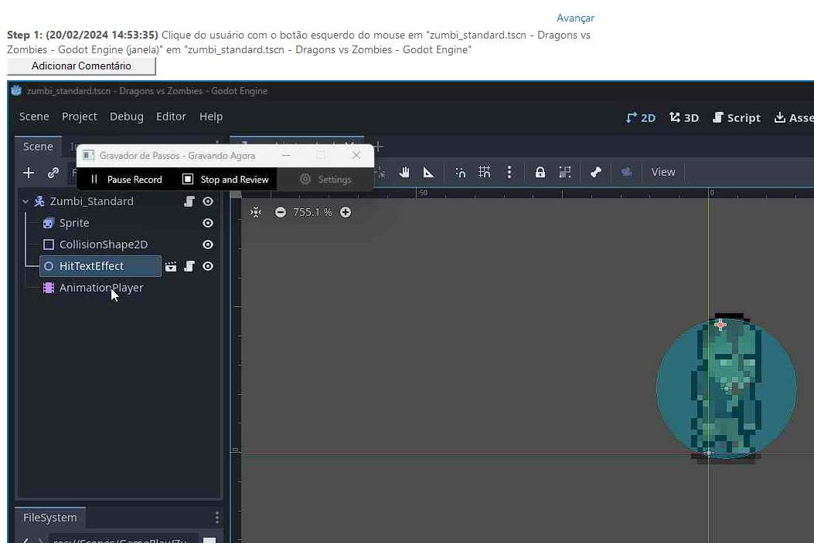
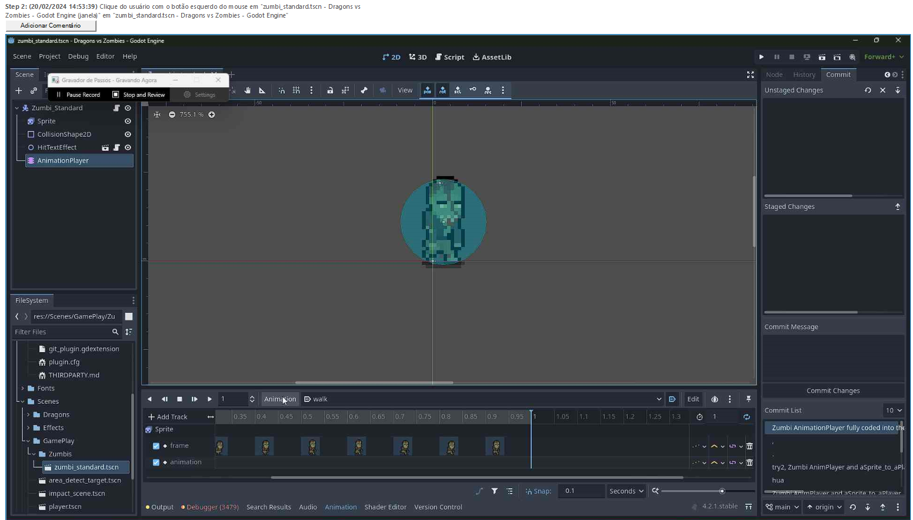
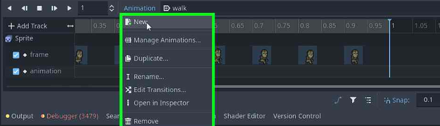
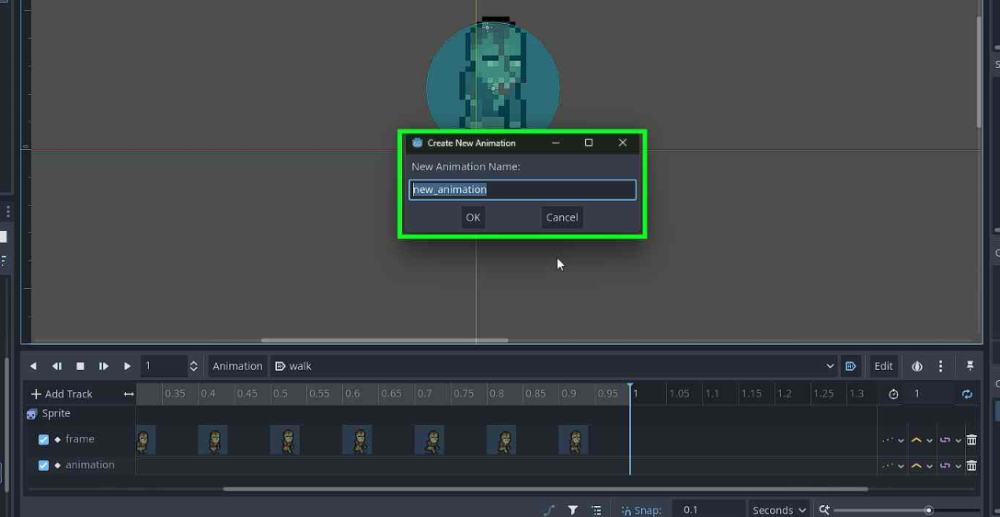
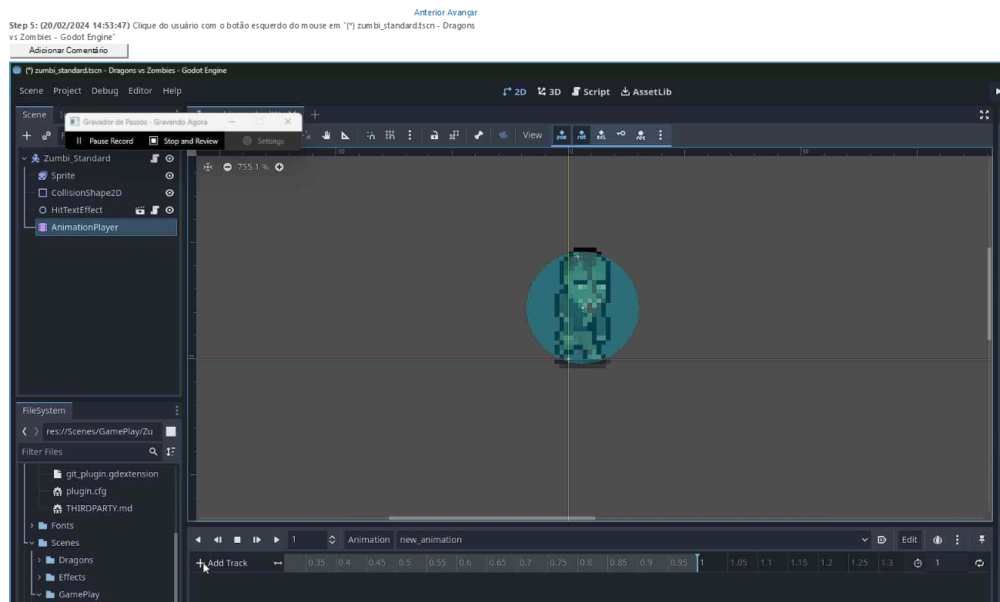
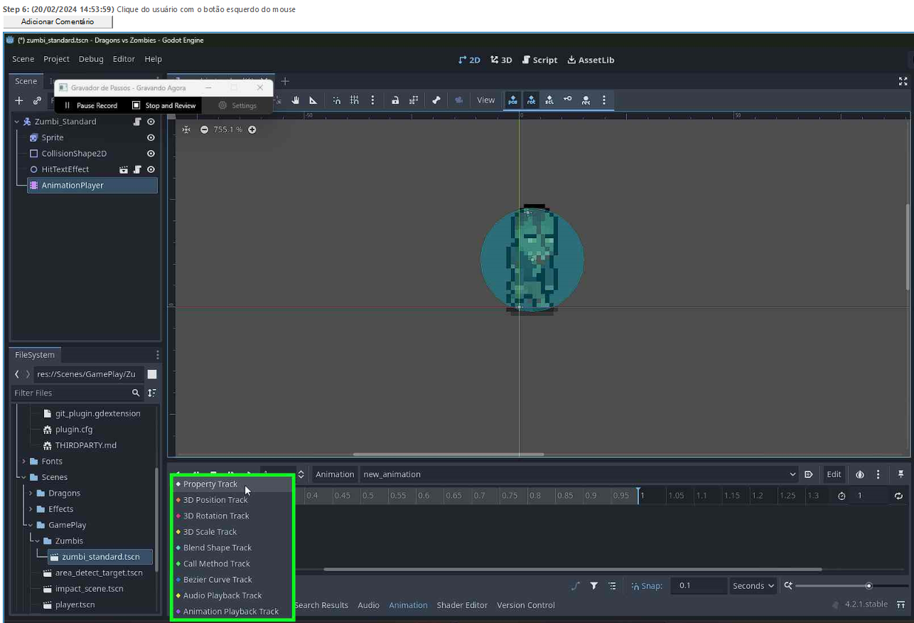

# Dragons VS Zombies

Este é um jogo Godot feito primariamente pelo *"David"* e equipe, sendo feito com a ajuda de *Cauã S. C. P.* ;
Para a Jam ***[Clecio Gamedev JAM #02](https://itch.io/jam/clecio-gamedev-jam-02)*** com o tema de ***DRAGÃO***. Acesse o [Itch.io](https://itch.io/jam/clecio-gamedev-jam-02) da jam [AQUI](https://itch.io/jam/clecio-gamedev-jam-02).


# [Adicionando Animações ao Zumbi (Clique Aqui)](https://github.com/CauaTheKing/dragons_vs_zombies/tree/main#como-adicionar-novas-anima%C3%A7%C3%B5es-ao-zumbi)


# Como Fazer uma COMMIT para o Projeto:

Durante a JAM (Termina em [24/02/2024](https://countingdownto.com/?c=5358335)) somente o pessoal da equipe poderá fazer commits;
Mas após ela, sinta-se livre para deixar sua contribuição, lembre-se que não necessariamente será colocada na branch principal.

## Comandos para fazer o commit:

Clone o repositório:

```sh
git clone https://github.com/CauaTheKing/dragons_vs_zombies.git
```

Faça suas mudanças nos arquivos...

Logo em seguida adicione os arquivos pelo comando ``git``...
```sh
git add . # O ponto adiciona o diretório atual, se estiver na pasta
          # do projeto, caso contrário use o comando cd, para adicio-
          # nar todos os arquivos, se não foram todos do projeto modi-
          # ficados apenas será adicionado os modificados.
git add file.ext # ↓
          # subtitua file.ext (ext: extensão fictícia) pelo arquivo ou
          # arquivos que queria adicionar separado por ESPAÇOS
git add diretorio/ # ↓
          # substitua diretorio/ pelo diretório desejado;
          # a / geralmente não interfere mas tenha cuidado se você não
          # utiliza windows, ou Unix sh/zsh.
```
#### \# como usar o comando CD:
```sh
cd ./dragons_vs_zombies # Powershell e terminais Unix based.
# OU
cd .\dragons_vs_zombies # Windows' CMD.
```
Depois use o ``comit`` do ``git``:
```sh
git commit -m "commit msg" # mude o /commit msg/ para algo mais
                           # facil de se entender que descreva
                           # a mudanças nos arquivos feitas por
                           # você.
```
Agora só dar o ``push`` do ``git``:

(AVISO, USE SOMENTE NA BRANCH MAIN DA ORIGIN)
```sh
git push # o comando variará se você estiver usando outra branch.
         # cheque o guia do git.
```
## Atualizando seus arquivos de acordo com o repositório no GitHub na branch Main/Origin:
só precisa rodar o:
```sh
git pull #...
```
e/(com) suas variações/argumentos.

# Como adicionar novas animações ao Zumbi:













### ***[Tutorial AnimationPlayer](https://youtu.be/V9kshvtj6s0)*** https://youtu.be/V9kshvtj6s0
